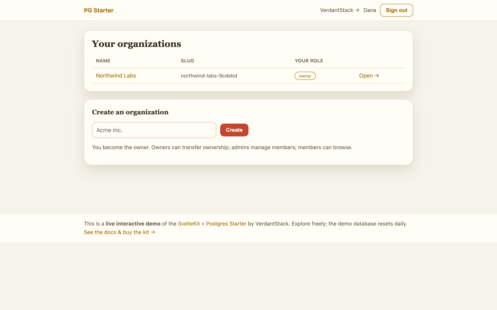
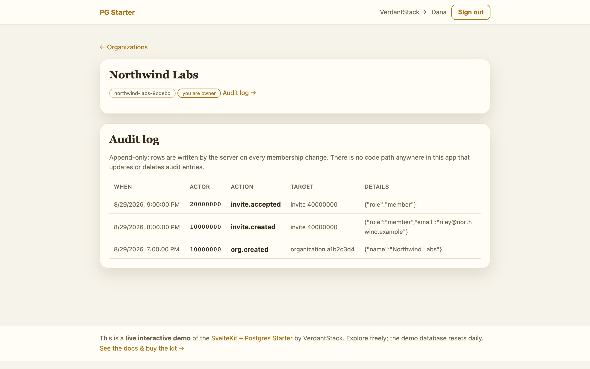
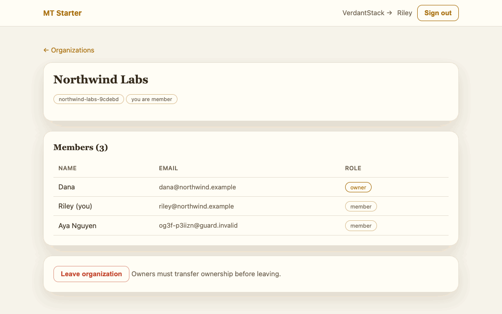
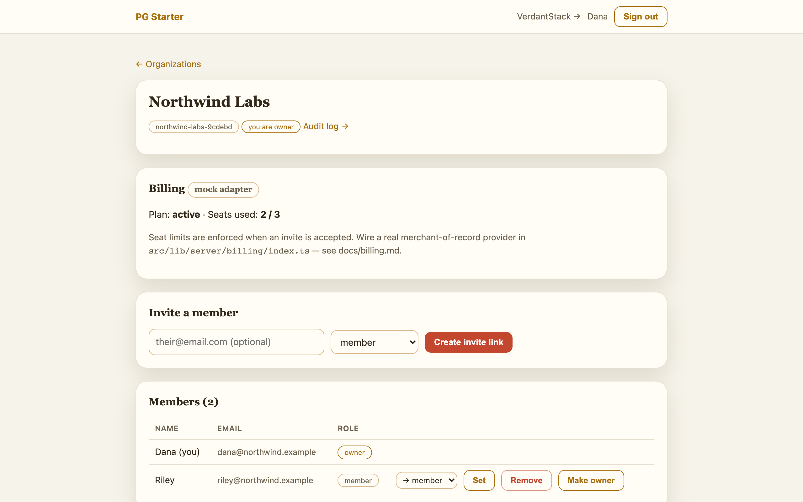
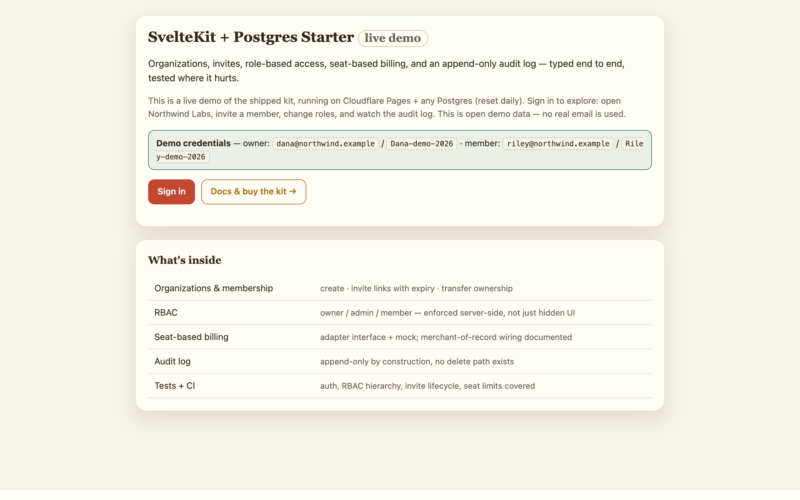
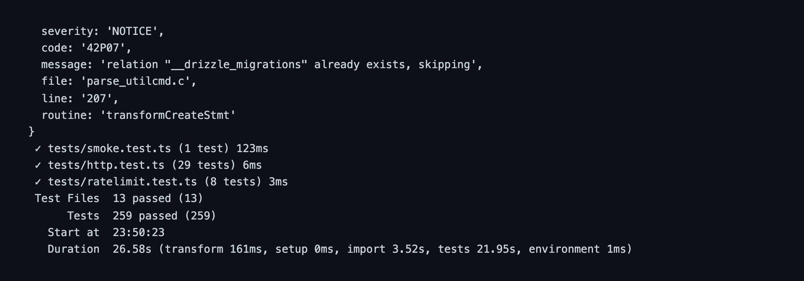

<p align="center">
  
</p>

<h3 align="center">SvelteKit + Postgres Starter</h3>

<p align="center">
  A production-grade B2B SaaS foundation for <strong>SvelteKit + Postgres</strong> with multi-tenancy wired end to end.
</p>

<p align="center">
  organizations & membership · invite links · role-based access control · seat-based billing · append-only audit log · failed-login rate limiting · Postgres RLS (opt-in) · connection pooling · tested where it hurts.
</p>

<p align="center">
  <a href="https://verdantstack-site.pages.dev/products/sveltekit-postgres-starter/">Documentation & guides →</a>
</p>

---

> ## 🔒 Get the full source
>
> This repository showcases the **SvelteKit + Postgres Starter**: the feature
> list and architecture docs below. The complete production source code (auth,
> RBAC, seat billing, audit log, rate limiting, Postgres Drizzle schema, RLS
> policies — **259 tests**) is included with your purchase under the
> [End User License Agreement](https://verdantstack-site.pages.dev/docs/license/):
> license · 30-day refund · **lifetime updates + lifetime standard support**.
>
> Questions? [verdantstack@proton.me](mailto:verdantstack@proton.me)

---

<!-- Metadata for AI agents and tooling -->
<!--
project_name: sveltekit-postgres-starter
project_type: starter-kit
language: TypeScript
framework: SvelteKit
database: PostgreSQL (Drizzle ORM + postgres.js, any provider)
auth: custom (scrypt + hashed sessions)
testing: Vitest
test_count: 259
license: Proprietary
version: 0.1.5
status: production-ready
changelog: https://github.com/verdantstack/sveltekit-postgres-starter/blob/main/CHANGELOG.md
releases: https://github.com/verdantstack/sveltekit-postgres-starter/releases
website: https://verdantstack-site.pages.dev/products/sveltekit-postgres-starter/
repository: https://github.com/verdantstack/sveltekit-postgres-starter
support_email: verdantstack@proton.me
support_patreon: https://www.patreon.com/cw/VerdantStack
features:
  - multi-tenancy
  - role-based-access-control
  - seat-billing
  - audit-log
  - rate-limiting
  - hashed-sessions
  - invite-links
  - postgres-rls
  - connection-pooling
tags: saas, starter, boilerplate, sveltekit, postgres, drizzle, multi-tenant, rbac, billing, audit, rls
-->

## Why this exists

Building a B2B SaaS? You'll need multi-tenancy, role-based access control, invite flows, seat-based billing, and an audit log. Every SaaS needs these. Every team rebuilds them from scratch.

This starter gives you all of them — **on real Postgres, with no provider lock-in** — wired together and tested, so you can focus on your actual product.

**What's included vs. free alternatives:**

| Feature            | Free starters | This kit                                 |
| ------------------ | ------------- | ---------------------------------------- |
| Auth               | ✅            | ✅ (scrypt + hashed sessions)            |
| Dashboard          | ✅            | ✅                                       |
| Multi-tenancy      | ❌            | ✅ (orgs, memberships, invites)          |
| RBAC               | ❌            | ✅ (owner > admin > member)              |
| Seat billing       | ❌            | ✅ (pluggable adapter)                   |
| Audit log          | ❌            | ✅ (append-only)                         |
| Rate limiting      | ❌            | ✅ (sliding window)                      |
| Real Postgres      | ❌            | ✅ (Drizzle + postgres.js, any provider) |
| Row-level security | ❌            | ✅ (opt-in hardening, `rls/`)            |
| Connection pooling | ❌            | ✅ (pool sizing + PgBouncer guidance)    |
| Tests              | 0–10          | 259                                      |

**The same service layer as the [Multi-tenant SvelteKit Starter](https://github.com/verdantstack/multi-tenant-sveltekit-starter).** The orgs/members/invites/RBAC/billing/audit logic is identical — only the database driver changes (`better-sqlite3` → `postgres.js`). If you've read one, you know the other.

## See it in action

Real UI captured from the **live deployed demo** — [postgres-starter.verdantstack-site.pages.dev](https://postgres-starter.verdantstack-site.pages.dev/) (seeded org, resets daily; click through free, no login needed to explore):

| Organizations home — sign in, pick an org                                           | Audit log — every event recorded, append-only                                    |
| ----------------------------------------------------------------------------------- | -------------------------------------------------------------------------------- |
|  |  |

### Role-based access control is enforced server-side — real session, ~3s

A member's view renders no admin controls; even a hand-crafted POST to promote the owner is rejected by the app with a real HTTP 403:



<details>
<summary>More screenshots (docs/screenshots)</summary>

| Screenshot                                                                                     | Caption                                          |
| ---------------------------------------------------------------------------------------------- | ------------------------------------------------ |
|  | Org dashboard — members, seats, invite controls  |
|       | Demo landing — credentials callout + buy-kit CTA |
|                        | Verbatim `npm test` output — 259 passing         |

</details>

## Status

**Version**: 0.1.5 | Last Updated: 2026-09-20 | **License**: Proprietary

[](CHANGELOG.md)
[](https://github.com/verdantstack/sveltekit-postgres-starter/releases)
[](https://www.patreon.com/cw/VerdantStack)
[](https://github.com/verdantstack/sveltekit-postgres-starter/blob/main/AGENTS.md)

- [x] Auth: email+password (scrypt), DB-backed revocable sessions, hashed session tokens
- [x] Rate limiting: sliding-window failed-attempt limiter on login/signup (verified over HTTP)
- [x] Orgs: create, slug, owner bootstrap
- [x] Invites: single-use hashed tokens, 7-day expiry, revoke, atomic claim
- [x] RBAC: `owner > admin > member`, capability matrix + hierarchy rules enforced server-side
- [x] Billing: `BillingAdapter` interface + `MockBillingAdapter` (seat limits enforced at join time)
- [x] Audit log: append-only by construction (no UPDATE/DELETE path exists)
- [x] Postgres: Drizzle schema (`uuid` ids, bigint-ms timestamps), checked-in migrations, pool sizing
- [x] RLS: opt-in defense-in-depth policies (`rls/0010_rls_policies.sql`)
- [x] Local dev: `docker-compose.yml` (Postgres 16, dev + test databases)
- [x] Tests: **259 passing** against a real Postgres test database
- [x] `svelte-check` clean; production build clean; flows verified over HTTP end-to-end
- [ ] Real MoR billing adapter (in progress — plugs into the same `BillingAdapter` seam)
- [ ] Read replicas / JSONB metadata / full-text search (documented add-yourself patterns in `docs/deployment.md`)

## Quick start

```bash
# 0. Prerequisites: Node.js 24+, Docker (for the local Postgres)
docker compose up -d        # Postgres 16 on :5433 (dev) + :5434 (test)

# 1. Install
npm install

# 2. Configure
cp .env.example .env        # defaults already point at docker-compose

# 3. Apply migrations + run
npm run db:migrate          # creates the schema in Postgres
npm run dev                 # http://localhost:5173

# 4. Test & check
npm test                    # 259 tests (needs TEST_DATABASE_URL; docker-compose's test-db)
npm run check               # svelte-check

# 5. Edit schema
npm run db:generate         # after editing schema.ts → new SQL migration
```

**Any Postgres provider works** — Neon, Railway, Supabase-direct, Fly.io, or
self-hosted. Just point `DATABASE_URL` at it and run `npm run db:migrate`.

**Verified from a clean copy:** fresh `npm install` → `docker compose up -d` →
migrations → tests → check → dev server → signup all pass.

## Try the full loop

1. Sign up (min 10-char password) → you land on `/app`.
2. Create an organization → you are its `owner`.
3. Invite a member → a one-time link like `/invite/<token>` is shown **once** (stored hashed).
4. Open the link in a private window → sign up → you're in as `member`.
5. As owner, change roles, transfer ownership, or remove members; watch every event appear in the org's **Audit log** tab.
6. Hit the seat limit (default 3) and see the honest error.

## Environment variables

| Variable               | Default              | Purpose                                                  |
| ---------------------- | -------------------- | -------------------------------------------------------- |
| `DATABASE_URL`         | (required)           | Postgres connection string (app)                         |
| `TEST_DATABASE_URL`    | (required for tests) | Postgres connection string (test DB, truncated per test) |
| `PG_MAX_CONNECTIONS`   | `20`                 | Connection pool size (postgres.js)                       |
| `PG_IDLE_TIMEOUT`      | `20`                 | Idle-connection close timeout (s)                        |
| `PG_CONNECT_TIMEOUT`   | `10`                 | Connection timeout (s)                                   |
| `MOCK_PLAN_SEATS`      | `3`                  | Seat limit while on MockBilling                          |
| `AUTH_FAILED_ATTEMPTS` | `5`                  | Failed attempts allowed per window                       |
| `AUTH_WINDOW_MS`       | `900000`             | Sliding window for failed auth attempts                  |

## Where things live

| Path                          | Purpose                                                                                   |
| ----------------------------- | ----------------------------------------------------------------------------------------- |
| `src/lib/server/db/schema.ts` | Drizzle Postgres schema — users, sessions, organizations, memberships, invites, audit_log |
| `src/lib/server/db/index.ts`  | postgres.js driver + Drizzle handle + auto-migrations at boot                             |
| `drizzle/`                    | Checked-in SQL migrations (applied via `migrate()` at boot)                               |
| `rls/`                        | Opt-in Row-Level Security policies (defense-in-depth hardening)                           |
| `src/lib/server/rbac.ts`      | Roles, permission matrix, hierarchy helpers                                               |
| `src/lib/server/auth.ts`      | scrypt hashing, session issue/verify/revoke                                               |
| `src/lib/server/ratelimit.ts` | `RateLimiter` seam + sliding-window failed-attempt limiter                                |
| `src/lib/server/services/`    | Org / member / invite domain logic (pure functions taking `Db`)                           |
| `src/lib/server/billing/`     | Adapter interface, mock implementation, wiring point                                      |
| `tests/`                      | Vitest suites against a real Postgres test database                                       |
| `docker-compose.yml`          | Local Postgres (dev :5433 + test :5434)                                                   |
| `docs/`                       | architecture · rbac · billing · testing · deployment · ai-billing · versioning            |

## Design rules worth knowing

- **Server-side enforcement everywhere**: UI hides controls, but every load/action re-checks membership and permissions against fresh DB state.
- **Tenancy is app-enforced by default; RLS is opt-in**: a pooled Postgres connection has no per-user identity (unlike Supabase), so the service layer is the tenancy boundary. `rls/0010_rls_policies.sql` adds database-level defense-in-depth for setups that adopt the per-request `app.current_user_id` GUC pattern (see `docs/deployment.md`).
- **Failed logins are expensive for the attacker, cheap for you**: attempts are counted per IP+email behind a swappable seam, and blocked keys are rejected before any password hashing happens.
- **Hierarchy is strict**: actors act only downward (`owner > admin > member`); grants never reach the actor's own rank; the last owner can neither leave nor be removed.
- **Secrets are stored hashed**: invite tokens and session tokens exist raw only at the moment of use.
- **No ORM lock-in at the edges**: domain services accept any `Db`; the same service layer runs on SQLite (Multi-tenant SvelteKit Starter) or Postgres (this kit).
- **Audit is append-only**: writers only; readers query; nothing deletes.

## Versioning & Releases

**Standing Rule:** Releases are cut by the VerdantStack release pipeline (bump → changelog → tag → public release) — this repo has no `npm run release`. Merges must keep the tree green:

```bash
npm test               # 259 tests
npm run check          # svelte-check
npm run build          # production build
npm run docs:api:check # API reference in sync (typedoc)
```

See [CHANGELOG.md](CHANGELOG.md) for change history and [docs/versioning.md](docs/versioning.md) for the full process.

## License

The full source is included with your purchase under the
[End User License Agreement](https://verdantstack-site.pages.dev/docs/license/).

30-day refund policy. Contact: verdantstack@proton.me

---

<p align="center">
  Built by <a href="https://github.com/verdantstack">VerdantStack</a>
</p>

<p align="center">
  <sub>Like this project? <a href="https://www.patreon.com/cw/VerdantStack">Support us on Patreon</a> for $5/month.</sub><br>
  <sub>Prefer GitHub? Hit the <b>Sponsor</b> button above — it goes to the same Patreon page.</sub>
</p>
