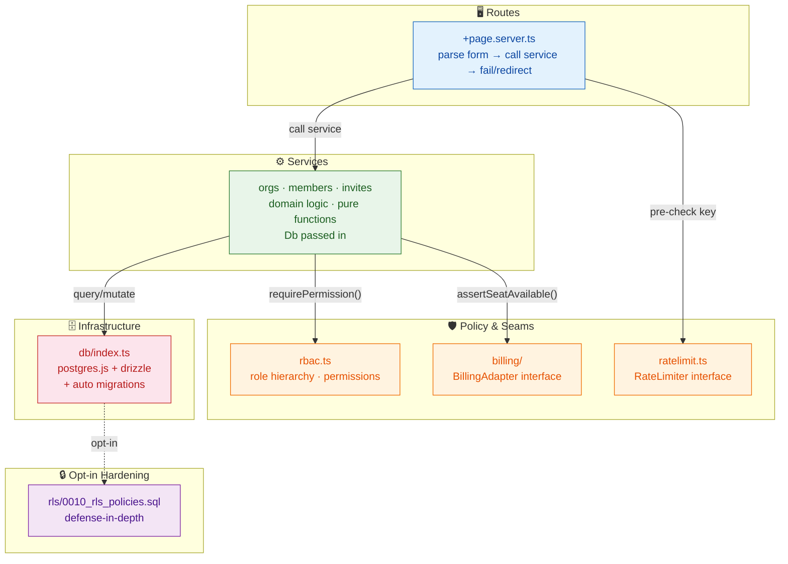
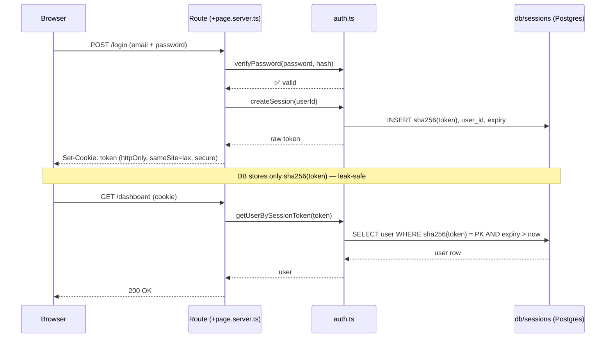
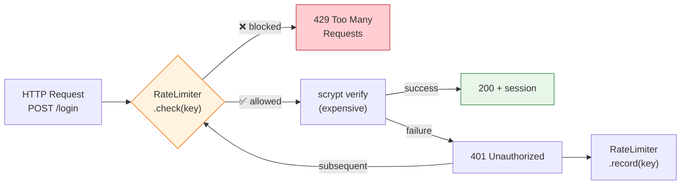

# Architecture

## Layering



Rules:

1. **Routes never touch the database directly** except to fetch read models via services. All writes go through a service so audit entries and permission checks can't be skipped.
2. **Services are framework-free** — they import nothing from `@sveltejs/kit`. That's what makes them unit-testable with a Postgres test database and no SvelteKit runtime, and portable to any framework.
3. **Every mutating service call re-derives authority from arguments**: callers pass `actorRole`, fetched fresh inside the same request (`requireRole()` re-reads the membership row). No trust in client-submitted role fields.
4. **Errors carry machine codes** (`AuthError`, `RbacError`, `InviteError`, `MemberError`, `OrgError`, `BillingError`). One mapper — `lib/server/http.ts:errorToFail()` — turns them into HTTP responses.

## Database

- **Driver:** `postgres.js` (asynchronous, connection-pooled, no native compilation).
- **ORM:** Drizzle (`drizzle-orm/postgres-js`), typed as `Db = PostgresJsDatabase<typeof schema>`.
- **Connection:** `DATABASE_URL`; pool sized by `PG_MAX_CONNECTIONS` (default 20). Connection/idle timeouts via `PG_CONNECT_TIMEOUT`/`PG_IDLE_TIMEOUT`.
- **Migrations:** checked-in Drizzle SQL in `drizzle/`; applied automatically at boot by `createDb()` via the Drizzle migrator, and on demand via `npm run db:migrate`.
- **Schema:** `users`, `sessions`, `organizations`, `memberships`, `invites`, `audit_log`. Primary keys are `uuid` (app-generated UUIDv4), timestamps are Unix epoch **milliseconds** as `bigint` (UTC everywhere) — an intentional portability choice that keeps the service layer identical to the SQLite starter.

### Tenancy & RLS (defense-in-depth)

Tenant isolation is **application-enforced by default**: the service layer verifies membership and permissions on every load/action. RLS is shipped as **opt-in hardening** in [`rls/0010_rls_policies.sql`](../rls/0010_rls_policies.sql) rather than enabled by default, because a pooled Postgres connection has no per-user identity the way Supabase's per-request `auth.uid()` does:

1. Apply the policies with a **low-privilege app role** (not the table owner, not `postgres`).
2. `FORCE ROW LEVEL SECURITY` makes the policies apply even to the app role — fail-closed: any path that forgets the GUC returns no rows.
3. The app sets the per-request identity in a transaction:
   ```ts
   await db.execute(sql`BEGIN`);
   await db.execute(sql`SET LOCAL app.current_user_id = ${locals.user?.id ?? null}`);
   // ... run the request ...
   await db.execute(sql`COMMIT`);
   ```

See `docs/deployment.md` → _RLS hardening_ for the full pattern and tradeoffs.

## Concurrency notes

- **Invite acceptance is one transaction.** `acceptInvite()` opens `db.transaction()` and, in order: (1) locks the organization row with `SELECT … FROM organizations WHERE id = ? FOR UPDATE`, (2) runs `assertSeatAvailable()` against that handle, (3) performs the single-use claim, (4) inserts the membership, (5) writes the audit row. Everything commits or rolls back together — a failed seat check or a failed insert leaves the invite unclaimed (still usable once a seat frees up or the conflict is resolved).
- **Single-use invites** don't rely on read-then-write. The claim is `UPDATE ... WHERE id = ? AND accepted_at_ms IS NULL AND revoked_at_ms IS NULL RETURNING id`; zero rows updated = someone got there first, and the conditional update is what makes the link safe under concurrent clicks. Postgres serializes conflicting updates to the same row correctly.
- **Seat counting**: `seatsUsed = COUNT(memberships)` per org, enforced at accept time. The count is exact at any scale *because* the check runs after the org-row lock inside the transaction — under READ COMMITTED, the count statement starts a fresh snapshot once the lock is granted, so it sees every membership a prior accept committed. Concurrent accepts for one org queue on the lock; the lock is always the first statement, so they can't deadlock.
- **Duplicate membership under a race**: one user accepting two different invites at once is stopped by `memberships_org_user_uq`; the `23505` is translated to `InviteError('already_member')` so the UI gets a domain error, not a 500, and the rollback leaves the second invite unclaimed.
- **Documented limits**: (a) the org lock is held while `billing.getSubscriptionState()` runs — with a real MoR adapter that call sits inside the lock, so plan-seat enforcement for one org is serialized behind that adapter's latency (the mock is instantaneous); (b) the row-lock approach deliberately avoids `SERIALIZABLE`/retry logic — a deployment that prefers non-blocking behavior can switch to `SELECT … FOR UPDATE NOWAIT` + a user-facing retry; (c) this guarantee is **Postgres-only** — the SQLite/D1 track has no `FOR UPDATE` (D1 offers `batch()` atomicity, not interactive transactions) and the Supabase/PostgREST track has no multi-statement transaction without an RPC, so those deployments must enforce seat limits via a database-side constraint or an RPC.

## Sessions



- Token: 32 random bytes, hex. Cookie holds the raw token (`httpOnly`, `sameSite=lax`, `secure` in prod).
- DB stores only `sha256(token)` as PK → a database leak doesn't yield usable sessions.
- Expiry: fixed 30 days v0.1 (sliding expiry is a deliberate non-goal until real usage data exists).

## Audit design

`audit_log.org_id`/`actor_user_id` are plain indexed text, **not foreign keys** — history must survive member removal and (future) org deletion. Metadata is a JSON string (`metadata_json`); writers decide what goes in, and the raw invite token is never audited. Postgres upgrade path: switch the column to `jsonb` and store objects directly (see `docs/deployment.md`).

## Auth rate limiting



`lib/server/ratelimit.ts` ships a `RateLimiter` interface (same seam philosophy as billing) with one concrete implementation: a sliding-window **failed-attempt** limiter. Only failures are recorded; success calls `reset()`. The login action pre-checks the key _before_ any scrypt work, so blocked floods cost ~nothing.

Wiring: `login/+page.server.ts` — key is `login:<client-ip>:<normalized-email>` for logins, `signup:<client-ip>` for signups. Tune with env: `AUTH_FAILED_ATTEMPTS` (default 5), `AUTH_WINDOW_MS` (default 900000 = 15 min). Blocked requests get HTTP 429 with an approximate retry window and no information about attempts remaining.

Scope honesty: the shipped limiter is **in-memory and per-process**. It stops single-source credential stuffing against a single instance. For multi-instance deployments implement the interface against a shared store (Redis or the SQL database) — no other code changes needed.

## Deliberate v0.1 limits

- Rate limiting is per-process (above) — shared-store implementation deferred until a real deployment topology exists.
- Invite links work for whoever holds them; optional `email` field is a human note, not enforcement. Email-enforced invites need email delivery, which requires a transactional email provider.
- RLS is opt-in (above) because the pooled-connection identity model requires the GUC pattern; enabling it for a multi-client setup needs the per-request transaction wiring documented in `docs/deployment.md`.
- JSONB metadata, full-text search, and read replicas are documented add-yourself patterns, not shipped defaults (see `docs/deployment.md`).
