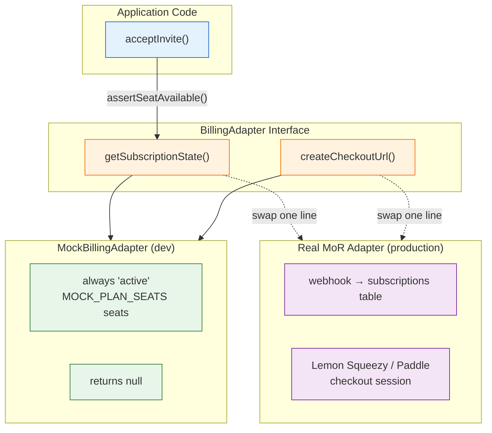
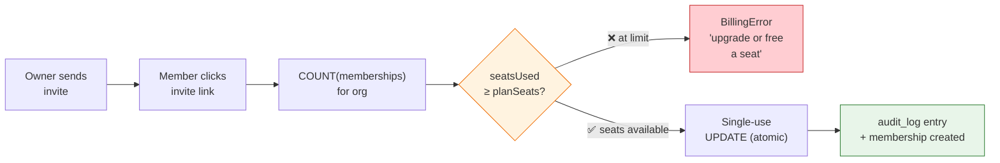

# Billing wiring (seat-based, merchant-of-record)

## Why an adapter



Checkout runs through a **Merchant of Record** (Lemon Squeezy / Paddle / Payhip are the usual candidates): the MoR becomes the legal seller of record and handles sales tax, so you don't register as a merchant in every jurisdiction your customers live in. Which MoR you pick is swappable by design — the product must not depend on that choice, so all payment knowledge sits behind:

```ts
// src/lib/server/billing/adapter.ts
export interface BillingAdapter {
  readonly name: string;
  getSubscriptionState(orgId: string): Promise<SubscriptionState>; // status + planSeats
  createCheckoutUrl(input: { orgId: string; seats: number }): Promise<string | null>;
}
```

Everything else in the codebase consumes the interface. Today it's satisfied by `MockBillingAdapter` (every org "active", `MOCK_PLAN_SEATS` seats, default 3). Wiring point: `src/lib/server/billing/index.ts` — swap one line, change nothing else.

## Where enforcement happens



Exactly one gate: **invite acceptance** (`assertSeatAvailable`). Inviting beyond the seat count is allowed on purpose — the limit surfaces at accept time as an actionable error ("upgrade or free a seat"), which is also how most incumbents behave and what beta testers expect to see.

Counting rule v0.1: `seatsUsed = COUNT(memberships)` for the org. Statuses other than `active`/`trialing` block joins entirely.

## What the real adapter must do

1. `getSubscriptionState`: map MoR subscription webhooks → `{status, planSeats}` rows keyed by orgId (add a `subscriptions` table; keep the interface).
2. `createCheckoutUrl`: create a checkout session for `plan-seats` product with `orgId` in passthrough metadata.
3. Webhook endpoint (new route, outside auth guard): verify signature → update local row. Never trust client-side success redirects for entitlements.
4. Keep `MockBillingAdapter` as the default under `NODE_ENV=development` so tests/dev stay hermetic.
