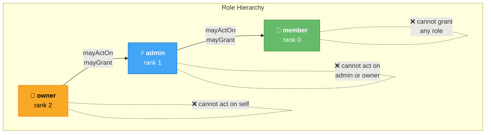
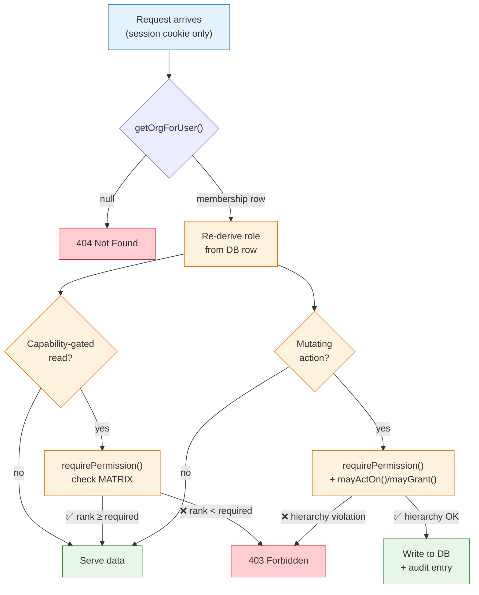

# RBAC model

## Roles

`owner > admin > member` (rank 2 > 1 > 0)

## Capability matrix

| Permission | owner | admin | member |
|---|:-:|:-:|:-:|
| org.view | ✓ | ✓ | ✓ |
| members.view | ✓ | ✓ | ✓ |
| members.invite | ✓ | ✓ | — |
| members.remove | ✓ | ✓* | — |
| members.role.set | ✓ | ✓* | — |
| invites.revoke | ✓ | ✓ | — |
| audit.view | ✓ | ✓ | — |
| billing.manage | ✓ | — | — |
| ownership.transfer | ✓ | — | — |

\* subject to hierarchy rules below.

The matrix lives in exactly one place: `src/lib/server/rbac.ts` (`MATRIX`). UI gating reads a server-computed `permissions` record; it is cosmetic only.

## Hierarchy rules (the part buyers get wrong)

Enforced in `members.ts` / `invites.ts` on every action:

1. **Act downward only** — `mayActOn(actor, target)` requires `rank(actor) > rank(target)`. An admin cannot touch another admin or the owner.
2. **Grant strictly below yourself** — `mayGrant(actor, granted)` requires `rank(actor) > rank(granted)`. Only owners mint admins; admins mint members. Nobody grants their own rank, ever.
3. **No self-modification** — you cannot change your own role, remove yourself via remove-member (use *Leave*), or transfer ownership to yourself.
4. **Single-owner invariant** — `transferOwnership` sets target→owner and actor→admin together; leaving while still the sole owner is refused (`last_owner`).

## Enforcement points

- Page loads: `getOrgForUser()` returns null unless the caller has a membership row; layout turns that into a 404. Capability-gated reads re-check the matrix on top of membership — e.g. the audit log's load runs `requirePermission(role, 'audit.view')` and answers 403 below admin.
- Actions: `requireRole()` re-reads the membership fresh per request; each service then runs `requirePermission()` + hierarchy checks before any write.
- Result: forging requests with another user's role field fails; only the session cookie matters, and capabilities derive from DB state.

## Test coverage

`tests/rbac.test.ts` pins the matrix; `tests/orgs-members.test.ts` proves the hierarchy end-to-end against a live Postgres schema, including the attempts that must fail.