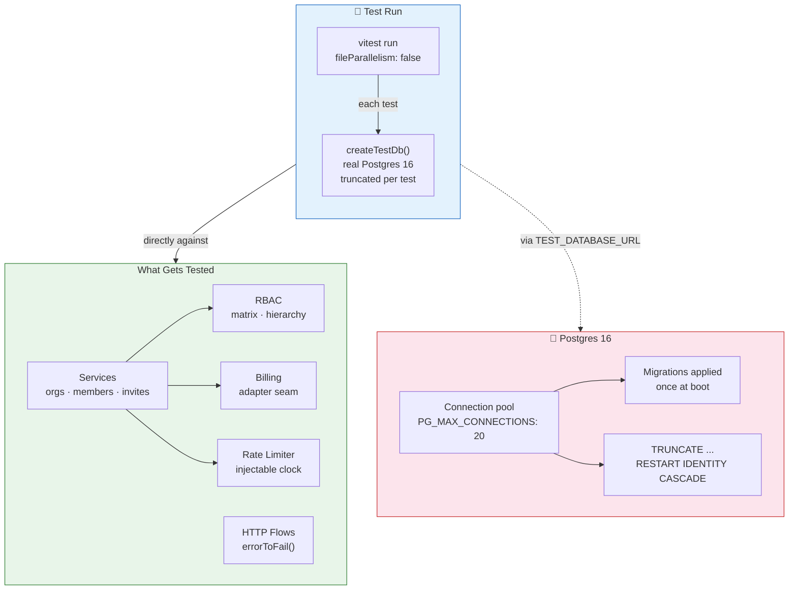

# Testing

## Philosophy



Tests exercise the **service and infrastructure layer directly** against a real Postgres database — no files, no network, no SvelteKit runtime. Every test starts from a clean database (see `tests/helpers/test-db.ts`, `createTestDb()`: migrations applied once, tracked tables truncated per test), so suites are fast, isolated, and portable to CI.

This buys:

- **Proof of the business rules** exactly where they live: services, RBAC, invite atomicity, seat gates, audit append-onlyness.
- **HTTP-level confidence** — `tests/http.test.ts` pins the error-mapping contract (redirects propagate, codes map to statuses) so route-layer regressions show up without a browser.
- **Honest boundaries** — rate limiting is tested against an injectable clock; billing is tested through the adapter seam, not a merchant SDK.
- **Real Postgres semantics** — migrations, constraints, unique indexes, and identity sequences are exercised on the same engine you'll deploy to.

## Running

```bash
docker compose up -d   # Postgres 16: dev :5433 + test :5434
cp .env.example .env   # TEST_DATABASE_URL → the test database
npm install
npm test               # vitest run — whole suite (194 tests)
npm run check          # svelte-check (TypeScript validation)
npm run build          # production build
```

The test database must be reachable at `TEST_DATABASE_URL`. CI runs the same suite against a Postgres 16 service container (`.github/workflows/ci.yml`).

## How isolation works

- Tests share one disposable database (`TEST_DATABASE_URL`).
- `createTestDb()` applies migrations once (idempotent via the Drizzle migrator's tracking table) and **truncates** `audit_log, invites, memberships, organizations, sessions, users` (`RESTART IDENTITY CASCADE`) on every call, so each test starts clean — the Postgres analogue of the SQLite starter's `:memory:` reset.
- `fileParallelism: false` in `vitest.config.ts` runs test files sequentially so the shared database is never contended.

## Suite layout

| File | Coverage |
|------|----------|
| `tests/auth.test.ts` | scrypt hashing (salted, malformed-hash safe), user creation validation + defaults, session issue/verify/revoke/expiry, hash-only token storage |
| `tests/rbac.test.ts` | Capability matrix pinning, hierarchy helpers (`mayActOn`/`mayGrant`), typed errors |
| `tests/orgs-members.test.ts` | Org creation (name rules, unique URL-safe slugs, member-only reads), role hierarchy end-to-end, removal/leave/transfer invariants, audit on mutations |
| `tests/invites-seats.test.ts` | Invite minting rules, default TTL, email normalization, single-use atomic claim, expiry/revoke/peek states, seat-limit gating + seat freeing |
| `tests/ratelimit.test.ts` | Sliding-window semantics with a fake clock: block/check/reset, window slide, key independence, eviction, scoped key format |
| `tests/http.test.ts` | `errorToFail()`: redirect control-flow propagates, code→status mapping (403/404/400/500) |
| `tests/billing.test.ts` | Seat counting, `assertSeatAvailable` (at-limit + no-subscription), mock adapter contract + env override |
| `tests/audit.test.ts` | Metadata round-trip, null handling, newest-first pagination, history survives member removal, no update/delete path |
| `tests/smoke.test.ts` | Migrations + user creation smoke check |

## Patterns

### Testing a service

Fresh `createTestDb()` per test, real users/orgs via the services themselves, rejections asserted by machine code:

```ts
await expect(setMemberRole(db, { orgId, /* … */ })).rejects.toMatchObject({
	code: 'hierarchy_violation'
});
```

### Testing time-dependent behavior

Rate limiting accepts an injectable clock (`now`). Tests own a fake clock and tick it — no `vi.useFakeTimers` needed, no sleeps.

### Adding a new service action

1. Add the permission to `MATRIX` in `rbac.ts` if needed.
2. Create the service function in `src/lib/server/services/`.
3. Accept `Db` as first argument, `actorRole` as needed; call `requirePermission()` before any write.
4. Write the audit entry in the same service call.
5. Add tests in `tests/` — happy path, every permission/hierarchy rejection, and the audit row.

## Gotchas

- **DB identity:** tests pass their own `createTestDb()` handle explicitly — never use `getDb()`, which resolves the process-wide singleton wired to `DATABASE_URL`.
- **Invite concurrency:** the single-use claim is a conditional UPDATE, not read-then-write. A test asserting single-use must observe the state-transition errors, not wrap things in transactions.
- **Audit is append-only:** there is no delete/update path. Tests assert it stays that way (module surface + history survival).
- **Postgres specifics:** `TRUNCATE ... RESTART IDENTITY` resets the `audit_log.seq` identity sequence between tests, so tests never depend on absolute sequence numbers. Connections are awaited — every `createTestDb()` call is `await`ed in `beforeEach`.